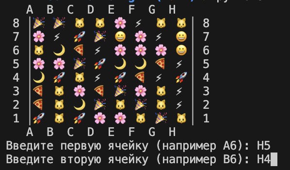

# three-in-a-row
The console implementation of the game is three in a row. The game is designed using an OOAP approach using DDD with a multi—layered architecture in the form of a DAG - Directed Acyclic Graph.

## Start

First of all we have to install python with:

macOS

```bash
brew install python@3.12
```

Linux (Debian/Ubuntu)

```bash
sudo apt update
sudo apt install python3
```

Secondary, check the version (need python3.9+):

```bash
python3 --version
```

Finally start the game:

```bash
cd three-in-a-row
python3 main.py
```

## Tests

For run tests

```bash
python3 -m unittest discover -p "*_test.py"
```

## Example of game

